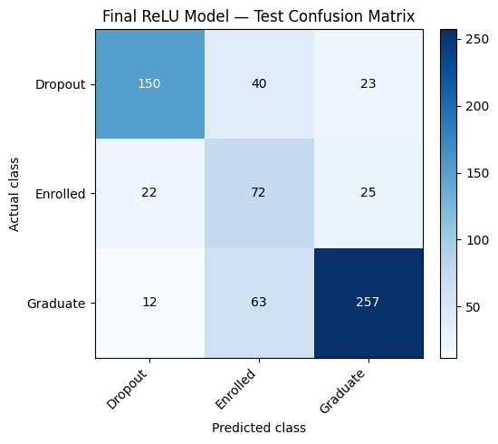

# Predicting Student Academic Outcomes with a Neural Network Built from Scratch

Predicts whether a student will **Dropout**, remain **Enrolled**, or **Graduate**, using only their background and first-two-semesters academic data — with a neural network implemented from raw numerical operations (no ML library used for the forward pass, backprop, or optimization).

## Why this project

Institutions often only notice a struggling student once it's too late to help. This model gives an early-warning signal after two semesters, so advisors can step in before a student leaves — and it's built from scratch specifically to demonstrate the mechanics of how neural networks actually learn, rather than treating them as a black box.

## Results

| Class | Precision | Recall |
|---|---|---|
| Graduate | 84% | 77% |
| Dropout | 81% | 70% |
| Enrolled | 41% | — |

**Overall accuracy: ~72%** on a held-out test set (664 students, never seen during training or tuning).

The model is strongest on the two "decided" outcomes and weakest on "Enrolled" — which makes sense: those students haven't reached a final outcome yet, so their data genuinely overlaps with both future graduates and future dropouts. That's a real-world ambiguity, not a modeling failure.

## Dataset

4,424 students, 36 raw features (demographics, financials, first/second-semester academic results) → expanded to 235 numerical features after preprocessing. Target split: Graduate 49.9%, Dropout 32.1%, Enrolled 17.9% (handled via class-weighted training).

## Approach

- **Preprocessing:** rare-category grouping, one-hot encoding of categorical codes, standardization (fit on training data only), stratified 70/15/15 train/val/test split
- **Feature engineering:** derived approval-rate and evaluations-per-course measures per semester — these separated the three outcome groups far more cleanly than the raw course counts
- **Model:** single hidden-layer neural network, implemented from scratch (forward pass, backprop, gradient updates all hand-coded)
- **Model selection:** compared network size (8 vs. 20 hidden units) and activation function (Sigmoid vs. ReLU) on a validation set; selected the 8-unit ReLU network for its balanced-accuracy edge and ~4x faster convergence
- **Class imbalance:** loss-weighted the minority "Enrolled" class during training
- **Early stopping:** training halted once validation performance stopped improving, to avoid overfitting
- **Reproducibility:** fixed random seed (42) throughout; notebook organized as a 42-section documented walkthrough with a written takeaway after each analysis step

## Key findings

- First/second-semester grades are the single strongest predictor of outcome
- Financial distress (overdue tuition, debt) correlates strongly with dropout; scholarship holders skew toward graduating
- Demographic and course-choice features carried little independent signal once academic performance was accounted for

## Practical takeaway

Retention efforts are likely to have more impact when targeted at students showing specific early-warning signs (low approval rate, overdue payments, debtor status) rather than applied uniformly — and "Enrolled" students who also show those signs are the group most worth watching closely.

## Future work

- Systematic hyperparameter search (architecture, learning rate) rather than manual comparison
- Deeper/wider architectures to capture more complex interactions
- More advanced optimizers (e.g. Adam) in place of the basic gradient update used here
- Additional features — attendance consistency, credit-completion trends over time
- Benchmark against gradient boosting / decision trees to test whether the neural network's added complexity is actually earning its keep on this dataset

## Tech

Python · NumPy (from-scratch NN implementation) · pandas · [add your viz library — matplotlib/seaborn]

---
*Note: the "from scratch" implementation means no scikit-learn/TensorFlow/PyTorch was used for the model itself — a deliberate choice to demonstrate understanding of the underlying math.*

